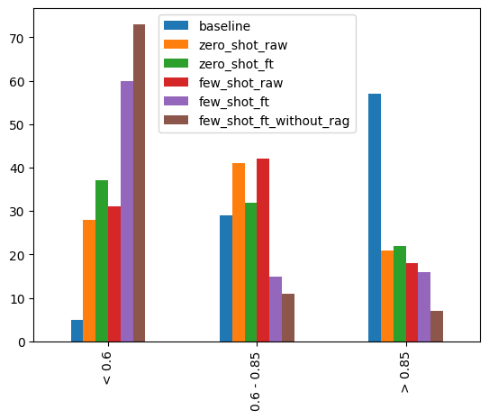

# 基于大语言模型的合入冲突解决代码生成

## 目标

本项目致力于开发一个辅助开发者合入分支代码的机器人*MergeBot*。输入为冲突代码片段（即由冲突标识符`>>>===<<<`及其上下文3行构成的片段），输出为冲突解决后的代码片段。

## 数据收集

在本仓库的 `script/generate_dataset.py` 中提供了从代码仓库中提取出合入冲突代码片段的脚本。

但是在实际使用时，参考 *On the Nature of Merge Conflicts: A Study of 2,731 Open Source Java Projects Hosted by GitHub* 的工作，他们提供了抽取和可视化冲突块工具，并且共享了他们的数据集成果。但是由于他们的数据集通过网页展示，而没有提供原始数据文件，因此写了一个简单的爬虫程序，获得这些冲突块文件，约90 000条数据。整理后的文件的格式为：

```python
data = {
    'conflict': conflict,
    'resolution': resolution
}
```

## 实验设计

### 提示词设定

```python
        SYS_PROMPT = """You are an assistant for resolving merge conflicts with given conflict chunks.
        You are first given several resolution examples following with an unresolved conflict chunk. Provide the resolution of the conflict chunk.
        Only output the resolution and do not output any explanation."""
        prompt = ""
        _ , retrieved_chunks = search(batch['conflict'], ST, index,  5)
        for i, (conflict, resolution) in enumerate(zip(retrieved_chunks['conflict'], retrieved_chunks['resolution'])):
            prompt += (f"""
Resolved Conflict {i}:

\```
{conflict}
\```

Resolution:

\```
{resolution}
\```

""")
        prompt = (f"""
Unresolved Conflict:

\```
{batch['conflict']}
\```

Resolution:

        """)
```

### RAG

通过检索与待解决的合入冲突相似的已有的合入冲突及其解决方案作为示例输入大语言模型，其中
- 索引（*index*）为已解决的示例冲突（*conflict*）
- 查询（*query*）为需要解决的冲突（*conflict*）

### 微调

- 基座大模型：Meta-Llama-3-8B-Instruct
- 微调方式：PEFT(LoRA)
- 文本结构：`        f"Resolve this merge conflict:\n{{conflict}}\n---\nResolution:\n"`
- GPU vRAM 最大使用 `20GB`，此时`batch_size=1, quantization=True`，否则 `24GB` vRAM无法满足训练要求
- 在80%数据集构成的训练集上训练一个epoch的时间约为8-9小时，出于成本和时间考虑，仅迭代了*3 epoch*

## 结果对比

### Baseline

本质上是利用 CodeT5-small 进行*Seq2Seq*训练和生成
<https://github.com/DJjjjhao/ase-merge.git>

### 指标

- CodeBLEU
- BLEU
- ROUGE
- Levenshtein Distance

### 对比

各种指标（CodeBLEU, BLEU, rouge）反应的效果大体上是一致的，凭感觉进行分段
1. < 0.6 几乎不可用，与实际解决方案相去甚远；
2. 0.6 - 0.85 比较接近，开发者可以参考其输出解决冲突；
3. \> 0.85 与参考输出非常接近，排除个别符号的差异可以直接使用。 

为了方便人工检查，测试集选取了数据集0.001的数据（约90条），观察每一条冲突解决方案的效果落在以上哪个区间内，并绘制出结果的分布



## 一些结论

### 初步结论

就目前的Baseline以及Llama3的输出结果来看，有一些初步结论：
1. Llama3 无论是通过微调或 *few shot prompting* 后效果均不如 *Baseline*。
2. 微调后的 Llama3 > 0.85 的比重优于没有微调的，但是 < 0.6 的比重却大幅增加。
3. 对比固定示例的 *few shot prompting*，通过 *RAG* 寻找相近的示例解决方案的效果更好，但却不如 *zero shot prompting*。（疑问？是否prompt中举例的方式不对）


也存在Baseline不如llama的例子
> baseline
```json
    {
        "ref": " */\npackage org.sqlite;\n\nimport java.util.Iterator;\nimport java.util.LinkedList;",
        "pred": " */ */\npackage org.sqlite;\n\nimport java.util.Collections;\nimport java.util.LinkedList;\n",
        "codebleu": 0.7281110610329494,
        "bleu": 0.4111336169005197,
        "rouge": 0.9090909090909091,
        "levenshtein": 13
    },
```

> llama finetuning
```json
    {
        "ref": " */\npackage org.sqlite;\n\nimport java.util.Iterator;\nimport java.util.LinkedList;",
        "pred": " */\npackage org.sqlite;\n\nimport java.util.Iterator;\nimport java.util.LinkedList;",
        "codebleu": 1.0,
        "bleu": 1.0,
        "rouge": 1.0,
        "levenshtein": 0
    },
```

### 可能的提升方案

1. 增加微调代数。
    Baseline 在数据集上迭代了约 16 epoch（约2小时），Llama 的微调仅进行了 3 epoch（约24小时）。这也是大模型的劣势，微调困难。
2. 优化提示词。
3. 使用CodeLlama
4. 小模型生成，大模型纠错

但是想要超过基线的表现非常困难。
